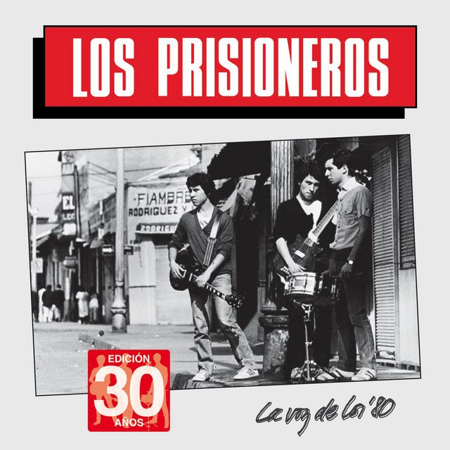

# Plantilla para solemne-02
- [Link a sketch de P5.js](https://editor.p5js.org/Tanytanita/sketches/hDYcTbRMt)
## Integrantes del grupo

- (Christian Petit-Laurent) [Chrisploo](https://github.com/Chrisploo)
- (Florencia Valencia) [zxxnie](https://github.com/zxxnie)
- (Catalina Vergara) [SoyTany](https://github.com/SoyTany)

## Descripción del disco



- (LA VOZ DE LOS '80)
- 1984
- Los Prisioneros
- Tracklist

```txt
1. La voz de los '80
2. Brigada de Negro
3. Latinoamérica Es un Pueblo en el Sur de Estados Unidos
4. Eve-Evelyn
5. Sexo
6. ¿Quién Mató a Marilyn?
7. Paramar
8. No Necesitamos Banderas
9. Mentalidad Televisiva
10. Nunca Quedas Mal Con Nadie
```

- Aspecto del álbum a desarrollar (premisa)

> Nuestro proyecto tiene como objetivo representar el mensaje y los conceptos clave del álbum La voz de los ’80 de Los Prisioneros. El álbum, en gran parte de sus canciones, expresa elementos como la rebeldía juvenil, la crítica social y la influencia de los medios. Para esto, nos imaginamos a personas en movimiento, con los puños arriba, como simbolismo de lucha y protesta. Entonces, colocamos esos mismos puños con la mecánica de que sean interactuables y se muevan con el comando del usuario (usando el mouse). Adicionalmente, el álbum comenta sobre los medios: que no deberían ser completamente confiables y nos invita a cuestionarlos. Para eso, colocamos imágenes de noticieros chilenos combinadas con protestas, junto con el mensaje del álbum en la parte superior, para que parezca un mensaje otorgado por un noticiero. La paleta de colores y la tipografía están basadas directamente en la portada del álbum. Adicionalmente, incorporamos un disco de vinilo interactuable como símbolo de la cultura punk de la época y, finalmente, un rayo en el centro para demostrar fuerza y movimiento.

## Conclusión del proceso

- Distancia entre premisa y resultado

> [Boceto/Idea](https://github.com/SoyTany/BITACORA_PENSAMIENTO_COMPUTACIONAL/blob/main/Entregas/Solemnes/Solemne-02/Recursos/Boceto-principal.png) En el resultado final logramos representar casi a la perfección el mensaje del álbum. Usamos elementos visuales, como puños siendo levantados coordinadamente, para representar protestas, junto a textos incluidos que expresan ese mismo mensaje.
 
> Adicionalmente, colocamos imágenes de noticieros chilenos mezcladas con protestas chilenas, para combinar de forma coherente la protesta y el llamado a no confiar completamente en los medios. Sumado a esto, agregamos una transición de color al rayo central, intercalando entre rojo y negro para una visual menos 2D a nuestro parecer, y generando ese efecto 3D haciendo que la "sombra" intercale de manera contraria con su contraparte, mateniendo el efecto continuamente.

- Cosas no conseguidas

> Queríamos que los puños fueran capaces de ser levantados y bajados en coordinación siguiendo el mouse, pero solamente logramos que, en la parte inferior de la imagen, los puños bajen y, en la parte superior, suban, estando limitados a la posición específica que tenga el curso dentro del canvas, en vez de solo subir y bajar con su límite mientras siguen el curso de arriba abajo independiente de la posición de este.

- Descubrimientos al trabajar

> Descubrimos que el constrain(); permite generar un margen invisible dentro del canvas para que los elementos que se muevan no sobrepasen dichos margen quedandose estáticos al tocarlo. También descubrimos que modificando un enlace de Github que lleve a la dirección de una imagen subida enel repositorio, podemos integrarla en el p5j logrando que cualquier persona que tenga el archivo, pueda visualizar las imágenes sin necesidad de tenerla en su ordenador (*reemplazar github.com*: raw.githubusercontent.com / *eliminar*: /blob)

## Explicación del código (3 aspectos)

### Bloque de código 1

```js
 if (mouseIsPressed) {
    angulo = angulo + 0.6;
```
Este bloque hace que al mantener presionado el cursor, el objeto rote en/al rededor del eje 0,0 a una velocidad controlable.
### Bloque de código 2

```js
if (frameCount % 12 === 0)
    fondoInicial = int(random(1, 9)); 
```
Este bloque hace que el frameCount(); sea dividido para que vaya más lento y así intercalar las imágenes a una velocidad lenta y modificable de manera aleatoria.
### Bloque de código 3

```js
  textLight = textLight + transicionColor;
  if (textLight <= 0) {
    transicionColor = 0.2;
  }
  
  if (textLight >= 50) {
    transicionColor = -0.5;
```
Este bloque hace que el color del texto vaya alternando periodicamente entre dos colores automáticamente a modo de transición enforma ciclica.
### Declaración sobre el uso de IA

- IA utilizada(s) y tipo de licencia (pago, gratuita)

> Gemini Ai (gratuita)

- Problema a resolver a través de la IA

> Hacer que el texto se mueva de ziquierda a derecha como los titulares de los noticieros, logrando que al salir del canvas, este se reinicie y vuelva a empezar.

- Prompts utilizados

>
```js
let discoVinilo;
let puño;
let angulo = 0;
let coloText;
let textLight = 50;
let transicionColor = -0.5;
let noticiero1, noticiero2, noticiero3, noticiero4, noticiero5, noticiero6, noticiero7, noticiero8; 
let fondoInicial = 1;

function setup() {
  colorMode(HSB, 360, 100, 100, 100);
  createCanvas(600, 600);
  angleMode(DEGREES);
  imageMode(CENTER);
  rectMode(CENTER);
}
function draw() {
  background(0, 0, 85);
  if (mouseIsPressed) {
    angulo = angulo + 0.6;
    if (frameCount % 12 === 0)
    fondoInicial = int(random(1, 9)); 
  }
  textLight = textLight + transicionColor;
  if (textLight <= 0) {
    transicionColor = 0.2;
  }
  if (textLight >= 50) {
    transicionColor = -0.5; 
  }
push();
  fill(360, 100, textLight);
  textFont("TEKO");
  textSize(35);
  text("LA JUVENTUD DEBE DESPERTAR Y TENER VOZ PROPIA. LA SOCIEDAD Y LOS MEDIOS MANIPULAN A LAS PERSONAS Y FOMENTAN EL CONFORMISMO. ES NECESARO CUESTIONAR LAS NORMAS Y GENERAR UN CAMBIO SOCIAL Y CULTURAL", 0, 30);
pop();
}
```
> Holi, tengo este código de p5j, logré hacer que el texto alterne su color en cuanto a la cantidad de brillo de forma constante y controlada. Quisiera hacer que dicho texto se mueva de izquierda a derecha como un noticiero de manera en que al salir totalmente del canvas, este vuelva a su posición original y vuelva a seguir su camino. 


- Secciones de código entregadas por la IA

```js
let xTexto = 600;
xTexto = xTexto - 2.5;
if (xTexto < -2350) { 
    xTexto = 600; 
  }
text("LA JUVENTUD DEBE DESPERTAR Y TENER VOZ PROPIA. LA SOCIEDAD Y LOS MEDIOS MANIPULAN A LAS PERSONAS Y FOMENTAN EL CONFORMISMO. ES NECESARO CUESTIONAR LAS NORMAS Y GENERAR UN CAMBIO SOCIAL Y CULTURAL", xTexto, 30);
```
## Bibliografía
- https://p5js.org/reference/p5/for/
- https://p5js.org/reference/p5/constrain/
- https://fonts.google.com/specimen/Anton+SC?preview.script=Latn&query=anton+SC
- https://es.wikipedia.org/wiki/La_voz_de_los_'80
- https://www.letras.com/los-prisioneros/372900/significado.html
- https://www.ciperchile.cl/2024/12/05/40-anos-de-la-voz-de-los-80-sintesis-y-bisagra-del-pop-chileno/
